# AIOps Root Cause Analysis System Design

## Overview

The AIOps Root Cause Analysis system is designed for deployment on **AWS AgentCore**, leveraging its native multi-agent orchestration, knowledge bases, and action groups. The system automatically analyzes AWS CloudWatch alarm incidents and determines root causes through iterative investigation workflows using AgentCore's built-in capabilities.

The architecture leverages **AWS AgentCore components**:
- **AgentCore Orchestration** for multi-agent coordination
- **Knowledge Bases** for storing investigation patterns and AWS best practices
- **Action Groups** for AWS service integrations (CloudWatch, X-Ray, CloudTrail)
- **Memory** for maintaining investigation context across rounds
- **Guardrails** for ensuring safe and compliant operations

## Architecture

### AWS AgentCore Architecture

```mermaid
graph TD
    A[CloudWatch Alarm] --> B[AgentCore Orchestrator]
    B --> C[Brain Agent]
    C --> D[Knowledge Base: Investigation Patterns]
    C --> E[Action Group: AWS Metrics]
    C --> F[Action Group: AWS Logs]
    C --> G[Action Group: AWS Traces]
    E --> H[CloudWatch APIs]
    F --> I[CloudWatch Logs APIs]
    G --> J[X-Ray APIs]
    H --> K[Executor Agent]
    I --> K
    J --> K
    K --> L[AgentCore Memory]
    K --> M[Evaluator Agent]
    M --> N{Investigation Complete?}
    N -->|Yes| O[Final Report]
    N -->|No| P[Update Memory & Restart]
    P --> C
```



### AgentCore Integration Components


## Components and Interfaces

### 1. AgentCore Orchestrator Integration

**Purpose**: Leverage AgentCore's native orchestration for multi-agent coordination.

**AgentCore Configuration**:
```json
{
  "agentName": "AIOpsRootCauseAnalyzer",
  "agentResourceRoleArn": "arn:aws:iam::account:role/AIOpsAgentRole",
  "foundationModel": "anthropic.claude-3-5-sonnet-20241022-v2:0",
  "instruction": "You are an AIOps system that analyzes AWS incidents...",
  "actionGroups": [
    {
      "actionGroupName": "CloudWatchMetrics",
      "actionGroupExecutor": "lambda:GetMetrics"
    },
    {
      "actionGroupName": "CloudWatchLogs", 
      "actionGroupExecutor": "lambda:GetLogs"
    },
    {
      "actionGroupName": "XRayTraces",
      "actionGroupExecutor": "lambda:GetTraces"
    }
  ],
  "knowledgeBases": [
    {
      "knowledgeBaseId": "investigation-patterns-kb",
      "description": "AWS investigation patterns and playbooks"
    }
  ]
}
```

### 2. Brain Agent (Primary AgentCore Agent)

**Purpose**: Main analysis agent deployed as AgentCore agent with investigation workflow generation.

**AgentCore Integration**:
- Uses AgentCore's conversation memory for investigation context
- Leverages knowledge bases for investigation patterns
- Calls action groups for AWS data collection
- Maintains state through AgentCore memory

**Action Group Calls**:
```python
# Brain Agent calls action groups through AgentCore
def analyze_metrics(self, alarm_data):
    return self.invoke_action_group(
        "CloudWatchMetrics",
        {
            "metric_name": alarm_data.metric_name,
            "namespace": alarm_data.namespace,
            "dimensions": alarm_data.dimensions
        }
    )
```

### 3. Action Groups (AWS Service Integration)

**CloudWatch Metrics Action Group**:
```python
def lambda_handler(event, context):
    """Lambda function for CloudWatch metrics collection"""
    metric_name = event['metric_name']
    namespace = event['namespace']
    dimensions = event['dimensions']
    
    # Use CloudWatch APIs to collect metrics
    cloudwatch = boto3.client('cloudwatch')
    response = cloudwatch.get_metric_statistics(...)
    
    return {
        "statusCode": 200,
        "body": json.dumps(response)
    }
```

**CloudWatch Logs Action Group**:
```python
def lambda_handler(event, context):
    """Lambda function for CloudWatch logs analysis"""
    log_group = event['log_group']
    start_time = event['start_time']
    
    # Use CloudWatch Logs APIs
    logs_client = boto3.client('logs')
    response = logs_client.filter_log_events(...)
    
    return {
        "statusCode": 200,
        "body": json.dumps(response)
    }
```

### 4. Knowledge Bases

**Investigation Patterns Knowledge Base**:
- Stores AWS investigation playbooks
- Contains root cause analysis patterns
- Includes AWS service troubleshooting guides
- Maintains historical investigation results

**Knowledge Base Structure**:
```
investigation-patterns/
├── ec2-cpu-high/
│   ├── investigation-steps.md
│   ├── common-causes.md
│   └── remediation-actions.md
├── rds-connection-failures/
│   ├── investigation-steps.md
│   └── troubleshooting-guide.md
└── network-latency/
    ├── investigation-steps.md
    └── performance-analysis.md
```

## Data Models

### AgentCore-Optimized Data Structures

```python
class AgentCoreInvestigation:
    """Investigation optimized for AgentCore memory"""
    session_id: str
    alarm_input: AlarmInput
    current_round: int
    investigation_state: Dict[str, Any]
    action_group_results: Dict[str, Any]
    knowledge_base_queries: List[str]
    confidence_score: float
    
class ActionGroupRequest:
    """Standardized request for AgentCore action groups"""
    action_group_name: str
    parameters: Dict[str, Any]
    context: Dict[str, Any]
    
class KnowledgeBaseQuery:
    """Query structure for AgentCore knowledge bases"""
    knowledge_base_id: str
    query_text: str
    max_results: int = 5
    
class AgentCoreMemoryEntry:
    """Memory entry for AgentCore conversation memory"""
    investigation_id: str
    round_number: int
    findings: Dict[str, Any]
    next_actions: List[str]
    timestamp: datetime
```

### AWS Service Integration Models

```python
class CloudWatchMetricsRequest:
    metric_name: str
    namespace: str
    dimensions: Dict[str, str]
    start_time: datetime
    end_time: datetime
    period: int = 300
    
class CloudWatchLogsRequest:
    log_group_name: str
    start_time: datetime
    end_time: datetime
    filter_pattern: Optional[str] = None
    
class XRayTracesRequest:
    service_name: str
    start_time: datetime
    end_time: datetime
    filter_expression: Optional[str] = None
```

## Deployment Architecture

### AWS AgentCore Deployment

```yaml
# AgentCore Agent Configuration
AIOpsAgent:
  Type: AWS::BedrockAgent::Agent
  Properties:
    AgentName: AIOpsRootCauseAnalyzer
    FoundationModel: anthropic.claude-3-5-sonnet-20241022-v2:0
    Instruction: |
      You are an AIOps system specialized in AWS incident root cause analysis.
      Use action groups to collect AWS service data and knowledge bases for investigation patterns.
    ActionGroups:
      - ActionGroupName: CloudWatchMetrics
        ActionGroupExecutor: !GetAtt MetricsLambda.Arn
      - ActionGroupName: CloudWatchLogs
        ActionGroupExecutor: !GetAtt LogsLambda.Arn
      - ActionGroupName: XRayTraces
        ActionGroupExecutor: !GetAtt TracesLambda.Arn
    KnowledgeBases:
      - KnowledgeBaseId: !Ref InvestigationPatternsKB

# Lambda Functions for Action Groups
MetricsLambda:
  Type: AWS::Lambda::Function
  Properties:
    Runtime: python3.11
    Handler: metrics_handler.lambda_handler
    Code:
      ZipFile: |
        import boto3
        import json
        def lambda_handler(event, context):
            # CloudWatch metrics collection logic
            pass

LogsLambda:
  Type: AWS::Lambda::Function
  Properties:
    Runtime: python3.11
    Handler: logs_handler.lambda_handler

TracesLambda:
  Type: AWS::Lambda::Function
  Properties:
    Runtime: python3.11
    Handler: traces_handler.lambda_handler

# Knowledge Base for Investigation Patterns
InvestigationPatternsKB:
  Type: AWS::BedrockAgent::KnowledgeBase
  Properties:
    Name: AIOpsInvestigationPatterns
    DataSource:
      Type: S3
      S3Configuration:
        BucketArn: !GetAtt KnowledgeBaseBucket.Arn
```

### Integration with AWS Services

```python
# AgentCore invocation from CloudWatch Alarms
def cloudwatch_alarm_handler(event, context):
    """Lambda triggered by CloudWatch alarms"""
    
    # Extract alarm data
    alarm_data = extract_alarm_from_sns(event)
    
    # Invoke AgentCore agent
    bedrock_agent = boto3.client('bedrock-agent-runtime')
    
    response = bedrock_agent.invoke_agent(
        agentId='AIOPS_AGENT_ID',
        agentAliasId='TSTALIASID',
        sessionId=f"investigation-{alarm_data['AlarmName']}-{int(time.time())}",
        inputText=f"Analyze this AWS alarm: {json.dumps(alarm_data)}"
    )
    
    return response
```

## Testing Strategy

### AgentCore Testing Approach

#### Unit Testing
- **Action Group Testing**: Test Lambda functions independently with mock AWS service calls
- **Knowledge Base Testing**: Verify knowledge base queries return relevant investigation patterns
- **Agent Prompt Testing**: Test agent responses with various alarm scenarios

#### Integration Testing
- **AgentCore Agent Testing**: Test complete agent workflows using AgentCore test harness
- **Action Group Integration**: Test agent → action group → AWS service integration
- **Memory Persistence**: Verify investigation state persists across conversation rounds

#### End-to-End Testing
- **Real Alarm Scenarios**: Test with actual CloudWatch alarms in test environment
- **Multi-Round Investigations**: Test iterative investigation workflows
- **Performance Testing**: Measure response times and resource usage

```python
# AgentCore Testing Framework
class AgentCoreTestHarness:
    def __init__(self, agent_id: str):
        self.bedrock_agent = boto3.client('bedrock-agent-runtime')
        self.agent_id = agent_id
    
    def test_investigation_workflow(self, alarm_data: dict) -> dict:
        """Test complete investigation workflow"""
        session_id = f"test-{uuid.uuid4()}"
        
        response = self.bedrock_agent.invoke_agent(
            agentId=self.agent_id,
            agentAliasId='TSTALIASID',
            sessionId=session_id,
            inputText=f"Analyze alarm: {json.dumps(alarm_data)}"
        )
        
        return self._extract_investigation_results(response)
```

### Monitoring and Observability

#### AgentCore Metrics
- **Agent Invocation Metrics**: Track agent calls, success rates, response times
- **Action Group Performance**: Monitor Lambda function execution times and errors
- **Knowledge Base Usage**: Track knowledge base query patterns and effectiveness

#### Investigation Quality Metrics
- **Root Cause Accuracy**: Measure accuracy of identified root causes
- **Investigation Completion Time**: Track time to resolution
- **Confidence Score Distribution**: Monitor confidence levels across investigations

```python
# CloudWatch Metrics for AgentCore
def publish_investigation_metrics(investigation_result: dict):
    cloudwatch = boto3.client('cloudwatch')
    
    cloudwatch.put_metric_data(
        Namespace='AIOps/Investigations',
        MetricData=[
            {
                'MetricName': 'InvestigationDuration',
                'Value': investigation_result['duration_seconds'],
                'Unit': 'Seconds'
            },
            {
                'MetricName': 'ConfidenceScore',
                'Value': investigation_result['confidence_score'],
                'Unit': 'Percent'
            }
        ]
    )
```